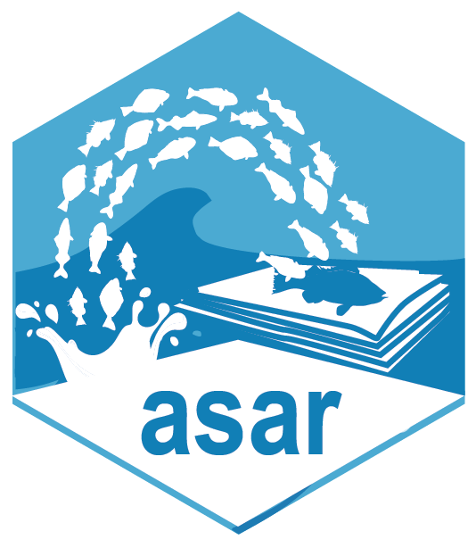

# asar (Automated Stock Assessment Reporting) 

<!-- badges: start -->
[](https://lifecycle.r-lib.org/articles/stages.html#experimental) [](https://github.com/nmfs-ost/asar/actions/workflows/call-r-cmd-check.yml) [](https://github.com/nmfs-ost/asar/tree/badges)
<!-- badges: end -->

Download using the directions below and fill in `create_template.R` function with 
the desired parameters (follow example below) to create a template Quarto document 
to be rendered to create a stock assessment report.

The goal of ASAR is to automate stock assessment reports for NOAA science centers
so they are reproducible and cohesive across the agency. This project intends 
to create a streamlined workflow that allows the analyst to create a customized 
report tailored to their needs and requirements by the SSC, council, or other 
regional management organizations. 

For users interested in testing, please see [Testing](#-testing-section) section below. 
In its current form, this package builds a  template to create a stock assessment report 
including NOAA Fisheries formatting and included tables and figures.

## Installation

First please check to make sure `tinytex` package is installed on your machine. If not, please install using the following lines:

```r
install.packages("pak")
pak::pkg_install("rstudio/tinytex")
```

Then install the package using one of the three following ways:

(1) Using `pak`

```r
install.packages("pak")
pak::pak("nmfs-ost/asar")
```

(2) Using `remotes`

```r
install.packages("remotes")
remotes::install_github("nmfs-ost/asar")
```

(3) From the noaa-fisheries-integrated-toolbox r-universe:

```r
install.packages('asar', repos = c('https://noaa-fisheries-integrated-toolbox.r-universe.dev', 'https://cloud.r-project.org'))
```

We also recommend to download the [`stockplotr` package](https://github.com/nmfs-ost/stockplotr). Use one of the previous download instructions to also install `stockplotr` by replacing 'asar' with 'stockplotr'.

## Example

The following code will allow the user to replicate the [2023 petrale sole stock assessment](https://www.pcouncil.org/documents/2024/02/status-of-petrale-sole-eopsetta-jordanialong-the-u-s-west-coast-in-2023.pdf/) 
produced by the NWFSC and made available by the Pacific Fisheries Management Council. 
The assessment model files are also available on the PFMC's website. A tutorial 
for using `asar` can be found [here](https://connect.fisheries.noaa.gov/asar_tutorial/).

The SS3 Report.sso file was converted using the following code:

```r
output <- stockplotr::convert_output(
  file = system.file("extdata", "Report.sso", package = "asar"),
  model = "ss3",
  save_dir = here::here("readme_output.rda"))
```

In this function, the users have the option to convert output files to a standardized 
framework from either SS3 (Report.sso) or BAM (.rdat) output files. `asar` uses this 
converted output from the environment to calculate quantities in the preamble and 
it is also used for creating plots and tables from [`stockplotr`](https://github.com/nmfs-ost/stockplotr).

To proceed, the user should then run the following:

```r
asar::create_template(
  format = "pdf",
  office = "NWFSC",
  region = "U.S. West Coast",
  species = "Petrale sole",
  spp_latin = "Eopsetta jordani",
  year = 2023,
  author = c("Ian G. Taylor"="NWFSC", "Vladlena Gertseva"="NWFSC", "Nick Tolimieri"="NWFSC"),
  include_affiliation = TRUE,
  simple_affiliation = FALSE,
  param_names = c("nf","sf"),
  param_values = c("North fleet", "South fleet"),
  model_results = here::here("readme_output.rda")
)
```

Note: The output of this report is an example based on a real stock assessment. Please refer to the link in the beginning of this section for the full assessment report.

[Here, you can find a list of reports created using `asar`](https://nmfs-ost.github.io/asar/articles/example-reports.html). Please let us know if you'd like us to add your own report to this list!

## Testing

We encourage users to test `asar` throughout its development. Please use the above example to get a basic understanding on how to create a stock assessment template. **Currently, `asar` is only setup to render to a pdf or html.** Once the user successfully executes `create_template()`, all files are created and the user can render the document from the skeleton file:

{alt="A basic skeleton produced by asar displaying the beginning of the quarto document called the yaml. The image shows the title, author, and other important formatting arguments to render a quarto document."}

All associated files will be created in a folder called `report` within the `file_dir` argument path (default working directory).

{alt="A screenshot of a file explorer showing the outline of quarto documents produced when running create template function from a.s.a.r. There are 15 quarto documents, a bib file, a glossary latex file, and a folder containing support files that dictate report format."}

This is a modularized template, there is no need to make any edits to the skeleton file. To write the report, user should navigate and open each supporting section Quarto document labeled:

-   Executive Summary
-   Introduction
-   Data
-   Assessment
-   Discussion
-   Acknowledgments
-   References
-   Tables
-   Figures 
-   Appendix

## Accessibility

Did you know that `asar` reports contain several accessibility features, many of which are required as per Section 508 compliance standards?

We strongly encourage all users to check out the [Increasing Report Accessibility vignette](https://nmfs-ost.github.io/asar/articles/accessibility_guide.html) to learn:

1. Which accessibility features are 100% built-in, and [which features require input from *you* to complete them](https://nmfs-ost.github.io/asar/articles/accessibility_guide.html#your-to-do-list)
2. How to add the features requiring your effort (e.g., [alternative text](https://nmfs-ost.github.io/asar/articles/accessibility_guide.html#alternative-text))
3. [The development status of the features](https://nmfs-ost.github.io/asar/articles/accessibility_guide.html#status-of-accessibility-features) that are required for submission as per two relevant NOAA checklists

## Contributions

Have you identified any suggestions for improvement, bugs, or questions? Please see our [Contributing page](https://github.com/nmfs-ost/asar/blob/main/CONTRIBUTING.md) for more information on how to make effective contributions to `asar`.

Thank you for helping us improve this package!

## Tips

If you have additional questions, there is a helpful Q&A guide available in the 
articles section of our GitHub Page located [here](https://nmfs-ost.github.io/asar/articles/faqs.html).

## User Community

This package is intended for use by stock assessment analysts across NOAA Fisheries, but the modularized process and workflow can be used in other applications such as developing other reports for managing organizations or for rendering stock assessment reports in other regions of the world.

Feel free to report any issues with the package to the [GitHub Issues Page](https://github.com/nmfs-ost/asar/issues) and any questions regarding the package on the [GitHub discussion board](https://github.com/nmfs-ost/asar/discussions). Before you create an issue, please see the status at the beginning of this page to check if the package is operational or still in early stages of development.

## Code of Conduct

We as members, contributors, and leaders pledge to make participation in our community a harassment-free experience for everyone, regardless of age, body size, visible or invisible disability, ethnicity, sex characteristics, gender identity and expression, level of experience, education, socio-economic status, nationality, personal appearance, race, caste, color, religion, or sexual identity and orientation. We pledge to act and interact in ways that contribute to an open, welcoming, diverse, inclusive, and healthy community.

All contributors participating and contributing to the asar project are expected to adhere to the [Code of Conduct](https://github.com/nmfs-ost/asar/blob/main/CODE_OF_CONDUCT.md).

## Disclaimer

This repository is a scientific product and is not official communication of the National Oceanic and Atmospheric Administration, or the United States Department of Commerce. All NOAA GitHub project code is provided on an ‘as is’ basis and the user assumes responsibility for its use. Any claims against the Department of Commerce or Department of Commerce bureaus stemming from the use of this GitHub project will be governed by all applicable Federal laws. Any reference to specific commercial products, processes, or services by service mark, trademark, manufacturer, or otherwise, does not constitute or imply their endorsement, recommendation, or favoring by the Department of Commerce. The Department of Commerce seal and logo, or the seal and logo of a DOC bureau, shall not be used in any manner to imply endorsement of any commercial product or activity by DOC or the United States Government.
