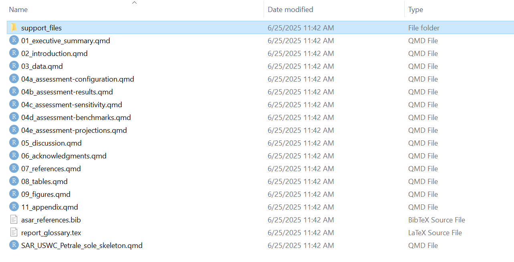

# asar (Automated Stock Assessment Reporting)

<!-- badges: start -->
<!-- badges: end -->

Test change for PR

This package is currently in development. For users interested in testing, please see [Testing](#-testing-section) section below. In its current form, this package builds a  template to create a stock assessment report including NOAA Fisheries formatting and included tables and figures.

Download using the directions below and fill in `create_template.R` function with the desired parameters (follow example below) to create a template Quarto document to be rendered to create a stock assessment report.


The goal of ASAR is to automate stock assessment reports for NOAA science centers so they are reproducible and cohesive across the agency. This project intends to create a streamlined workflow that allows the analyst to create a customized report tailored to their needs and requirements by the SSC, council, or other regional management organizations. 

## Installation

First please check to make sure `tinytex` package is installed on your machine. If not, please install using the following lines:

```r
install.packages("tinytex")
library(tinytex)

```
Then install the package using one of the three following ways:

(1) Using remotes

```r
install.packages("remotes")
remotes::install_github("nmfs-ost/asar")
```

(2) Occasionally, the package can not be installed using the `remotes` package. If this is the case for you, please try:

```r
install.packages("pak")
pak::pak("nmfs-ost/asar")
```
(3) From the nmfs-ost r-universe

```r
install.packages("asar", repos = c("https://nmfs-ost.r-universe.dev", "https://cloud.r-project.org"))
```

We also recommend to download the `stockplotr` package. While it is listed as a dependency of the package, it sometimes does not load as intended. Use one of the previous download instructions to also install `stockplotr` by replacing 'asar' with 'stockplotr'.

## Example

The following code will allow the user to replicate the [2023 petrale sole stock assessment](https://www.pcouncil.org/documents/2024/02/status-of-petrale-sole-eopsetta-jordanialong-the-u-s-west-coast-in-2023.pdf/) produced by the NWFSC and made available by the Pacific Fisheries Management Council. The assessment model files are also available on the PFMC's website. A tutorial for using `asar` can be found [here](https://connect.fisheries.noaa.gov/asar_tutorial/).

The SS3 Report.sso files was converted using the following code:

```r
asar::convert_output(
  output_file = "Report.sso",
  outdir = "~/data",
  model = "ss3",
  file_save = TRUE,
  save_name = "petrale_convert_output")
```

In this function, the users have the option to convert output files to a standardized framework from either SS3 (Report.sso) or BAM (.rdat) output files. The converted output was saved as an Rdata file and can be found in the example folder in this repository. Typically, when saving converted output from the `convert_output` function, the resulting file is a csv.

To proceed, the user should then run the following:

```r
asar::create_template(
  format = "pdf",
  office = "NWFSC",
  region = "U.S. West Coast",
  species = "Petrale sole",
  spp_latin = "Eopsetta jordani",
  year = 2023,
  author = c("Ian G. Taylor", "Vladlena Gertseva", "Nick Tolimieri"),
  include_affiliation = TRUE,
  simple_affiliation = FALSE,
  param_names = c("nf","sf"),
  param_values = c("North fleet", "South fleet"),
  resdir = "data",
  model_results = "Petrale_sole_std_res_2023.csv",
  model = "SS3",
  rda_dir = file.path(getwd(), "report"),
  end_year = 2022
  ref_line = "msy",
  ref_line_sb = "msy",
  indices_unit_label = ""
)
```

Note: The output of this report is an example based on a real stock assessment. Please refer to the link in the beginning of this section for the full assessment report. 

## Testing

We encourage users to test `asar` throughout its development. Please use the above example to get a basic understanding on how to create a stock assessment template. **Currently, `asar` is only setup to render to a pdf.** Once the user successfully executes `create_template()`, the template Quarto file will open:


All other associated files will be created in a folder called `stock_assessment_reports` within the user's documents folder. From there, a file system following the user's associated science center > species name > region (if applicable) > year. The user will have to navigate to this folder to find additional files.



This is a modularized template, there is no need to make any edits to the skeleton file. To write the report, user should navigate and open each supporting section Quarto document labeled:

-   Executive Summary
-   Introduction
-   Data
-   Assessment
-   Discussion
-   Acknowledgments
-   References
-   Tables
-   Figures 
-   Appendix

Please leave an issue for any bugs or suggestions for improvement on the [Issues Page](https://github.com/Schiano-NOAA/ASAR/issues). Please remember that this package is currently in development and we do not project to release version 1.0 until December 2024. Thank you for helping us improve this package!

## Tips

If there you receive an error creating your template due to authorship. Please submit requests to be added to the national archive for assessment scientists using [this issue](https://github.com/nmfs-ost/asar/issues/19). The developers will add you to the list as soon as possible. In the meantime, you can use the argument `create_template(add_author = "First Last")` to add yourself to the template. 

If you have additional questions, there is a helpful Q&A guide available in the articles section of our GitHub Page located [here](https://nmfs-ost.github.io/asar/articles/faqs.html).

## User Community

This package is intended for use by stock assessment analysts across NOAA Fisheries, but the modularized process and workflow can be used in other applications such as developing other reports for managing organizations or for rendering stock assessment reports in other regions of the world.

Feel free to report any issues with the package to the [GitHub Issue Page](https://github.com/Schiano-NOAA/ASAR/issues) and any questions regarding the package on the [GitHub discussion board](https://github.com/Schiano-NOAA/ASAR/discussions). Before you create an issue, please see the status at the beginning of this page to check if the package is operational or still in early stages of development.


## Disclaimer

This repository is a scientific product and is not official communication of the National Oceanic and Atmospheric Administration, or the United States Department of Commerce. All NOAA GitHub project code is provided on an ‘as is’ basis and the user assumes responsibility for its use. Any claims against the Department of Commerce or Department of Commerce bureaus stemming from the use of this GitHub project will be governed by all applicable Federal laws. Any reference to specific commercial products, processes, or services by service mark, trademark, manufacturer, or otherwise, does not constitute or imply their endorsement, recommendation, or favoring by the Department of Commerce. The Department of Commerce seal and logo, or the seal and logo of a DOC bureau, shall not be used in any manner to imply endorsement of any commercial product or activity by DOC or the United States Government.
