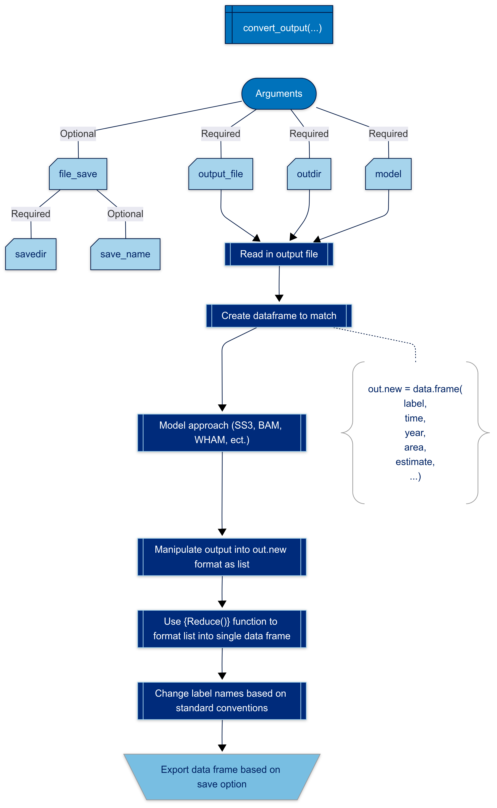

```{css, echo=FALSE}
pre {
  overflow-x: auto;
  overflow-y: auto;
}

pre[class] {
  max-height: 100px;
}
```

```{r setup, include=FALSE}
knitr::opts_chunk$set(echo = TRUE)
```

## Background

This article describes the process behind developing convert_output and its setup so users who want to use `asar` or `satf` are still able until [`convert_output.R`](https://github.com/nmfs-ost/asar/blob/main/R/convert_output.R) includes functionality for other models.

Additionally, after following this article, users who use it to manipulate their assessment output are encouraged to submit a [pull request](https://github.com/nmfs-ost/asar/pulls) or [issue](https://github.com/nmfs-ost/asar/issues) to use as an example to include in the function. This collaboration will not only allow us to expand the converter to include many assessment models, but also do it *much faster*.

The converter was designed so that it would manipulate the output file from the assessment (Report.sso for SS3, .rdat from BAM...). This means that we have only configured it to work with a singular output file so the converted data frame is limited to the data given to it from that file. We have plans to expand upon this format to include other data files associated with running the model, but this will not happen in the near future.

{height="50%}

## Set up and format

The converter manipulates data sets by recognizing patterns based on the assessment model (SS3, BAM, ect) and organizes it by expanding all data as single columns. This makes the data frame more machine readable allowing users to plot the data or place it into tables. The format also helps us as developers create other standardized procedures and automation due to its ease of use.

The data is manipulated to follow the format in @tbl-cols. The majority of the code in the function is specific for how one would manipulate the output with some minor exceptions. The code in the converter creates an empty data frame with the columns referenced in @tbl-cols (See [code](https://github.com/nmfs-ost/asar/blob/c8db61f325e9926461c70ef2d62349eb8d2bf2dd/R/convert_output.R#L45-L81)). At the end of the function, standard naming conventions are applied to rename labels of parameters or quantities as followed in @sec-namecon. Currently, we have files to use as examples to change the names of labels following our convention. One of the example files can be downloaded [here](https://github.com/nmfs-ost/asar/blob/main/inst/resources/ss3_var_names.xlsx). The final data frame is saved as a csv or exported to the users environment if assigned.


```{r, echo=TRUE}
load("example_conout.rda")
head(hake_conout)
```


The data frame is structured in following the convention of FIMS but removing the use of S4 or S3 data frame classes encouraging a more user friendly set up to start. The following format outlines the standard data frame:

| Column label | Description                                 |
|--------------|---------------------------------------------|
| label        | standard name for the estimate/parameter/quantity (cha) |
| estimate     | the actual value for the estimate/parameter/quantity |
| module_name  | describes the category of data found in the original data - allows us and familiar users to validate the converter is operating correctly and the correct data is being pulled |
| year | year of the data point if applicable otherwise NA |
| uncertainty | uncertainty *value* (for estimates) |
| uncertainty_label | label for the uncertainty value (i.e. se, sd, cv...) |
| {strata} | a series of additional columns when stratification of the stock is present (fleet, age, time, area, season, sex, growth pattern) |
| likelihood | if present, the likelihood value for the label; typically NA |
| initial | the initial estimate input into the model associated with the label, if applicable |:Descriptions of column names found in a standardized model output made from `convert_output()`.{#tbl-cols}

There are a variety of ways to stratify the stock. The current converter is built to recognize the following:

<!---
The following code does NOT create separate columns when pkgdown site is built
--->

:::::::::::::: {.columns}
::: {.column width="40%"}

* month
* fleet
* fleet_name
* age 
* time (typically YYYY.##)
* area
* season
* subseason
* sex
* sexes (only if indicating difference from above)
* growth_pattern / gp

:::
::: {.column width="60%"}

* len_bins (length bins for length-at-age models or related length series outputs)
* birthseas
* settlement
* morph
* type
* platoon
* part
* bin
* kind
* nsim
* age_a

:::
::::::::::::::

**Notes:**

  *NA is present in any of the above columns if there isn't an occurrence from the original assessment output*

  *Era was removed as a factor from SS3 converted output files since this is something that could be assumed due to the set up of the data*

## Naming Conventions {#sec-namecon}

Another hurdle to tackle is naming conventions. We have attempted to create a standard naming convention system so that the same values are called each time no matter the assessment model. Unfortunately, this can't be perfect, but there are approaches we took to standardize naming as best as we could. In terms of naming:

1. Generally, labels and other strings are lowercase. Exceptions to this case only include commonly referred to fisheries acronyms such as biomass (B), R0, ect...

- This does not apply to catch and fishing mortality since C and F are used in the R language (a common language used in fisheries). In these two cases, the terms are spelled out in lowercase.

2. Fleet names are inherited so they are easily called by the analyst familiar with the data.

3. Labels with more than one word use string case (i.e. spawning_biomass).

4. The full name is used for the label, unless there is a common and *well known* acronym for it such as spr, cpue, R0, or it is a point relative to a reference point (i.e. b_msy = $B_{msy}$, b_b_msy = $B/B_{msy}$)

5. For labels specific to a stock or assessment model, they were kept in the converted output, but edited/expanded upon following the above conventions.

6. In cases where a label could not be standardized, the same label was kept in the converted output. We hope that these remaining names can be standardized in the future through collaboration with the respective analysts using them.

## Final Formatting

[`convert_output()`](https://github.com/nmfs-ost/asar/blob/main/R/convert_output.R) exports data frames as a csv. While this is not necessary to the function of {asar} and {satf} packages as a whole due to their setup, we recommend continuing this practice to remain consistent with the function.

The final data frame does not manipulate column typing (character, numeric, ect). We have left that to the analyst or other functions since there can be conflicts within the estimates due to NAs. Ideally, all columns beside the following with remain as characters or factors and the following will be converted to numeric:

  - estimate
  - uncertainty
  - initial
  - likelihood
  
In conclusion, the final data frame should be very long with repeating years and factors to represent each point of data from the output file. Some metrics such as estimated stock-recruitment curve, weight-length relationship or other similar parameters are not currently 

## Helpful Functions to Mainpulate Data

The following functions were used in the [`convert_output()`](https://github.com/nmfs-ost/asar/blob/main/R/convert_output.R) function that could be helpful for users replicating it for other assessment models:

- dplyr::mutate
- dplyr::case_when
- dplyr::inner_join/dplyr::outer_join
- tidyr::pivot_longer/tidyr::pivot_wider
- tidyr::rownames_to_column
- stringr::str_replace
- stringr::str_remove
- stringr::str_extract
- tibble::rowid_to_columns
- tidyselect::any_of/tidyselect::all_of
